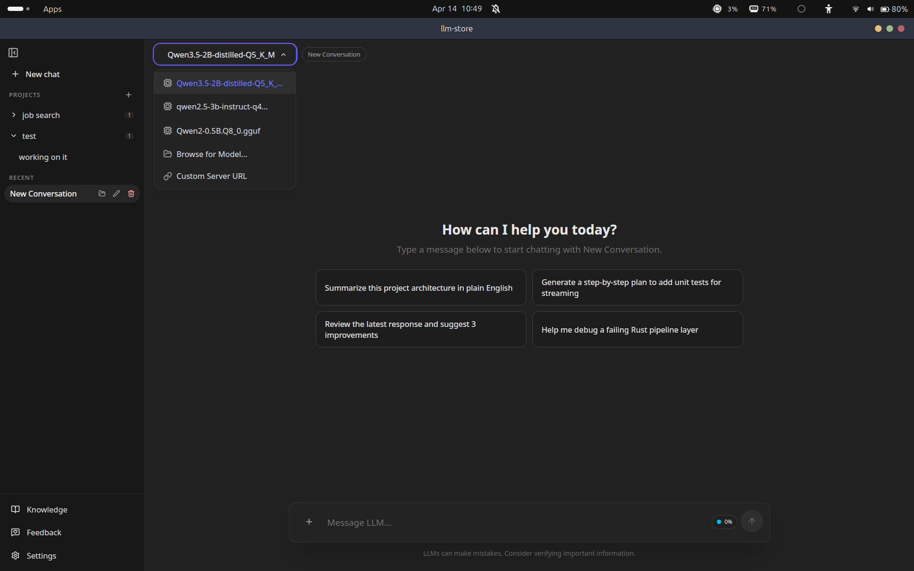
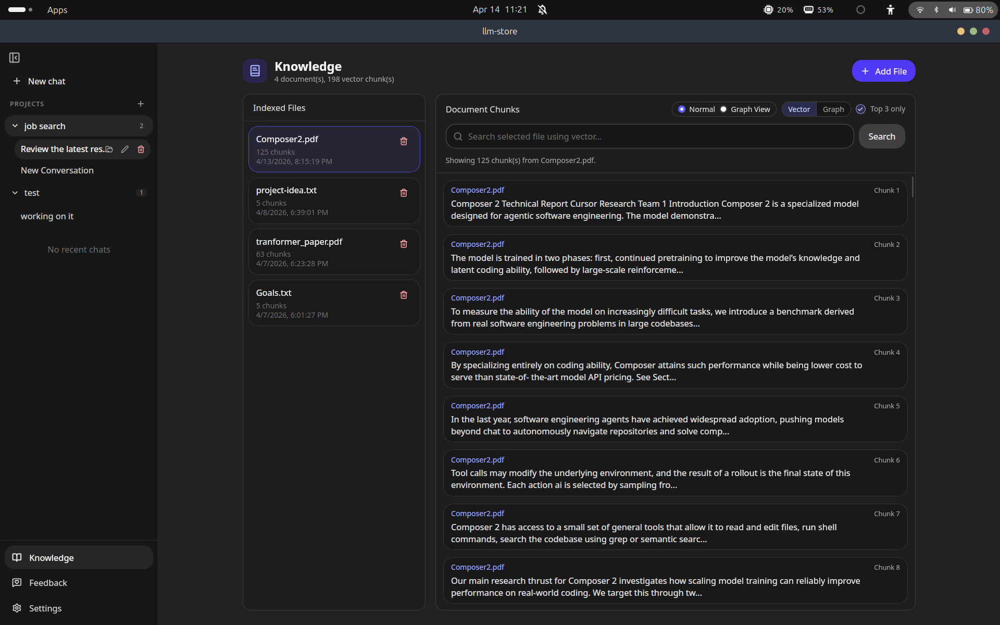
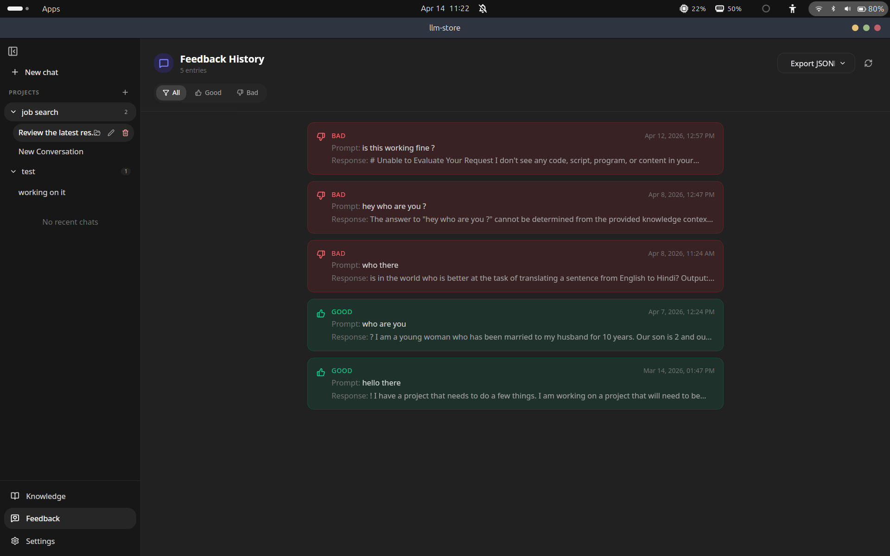
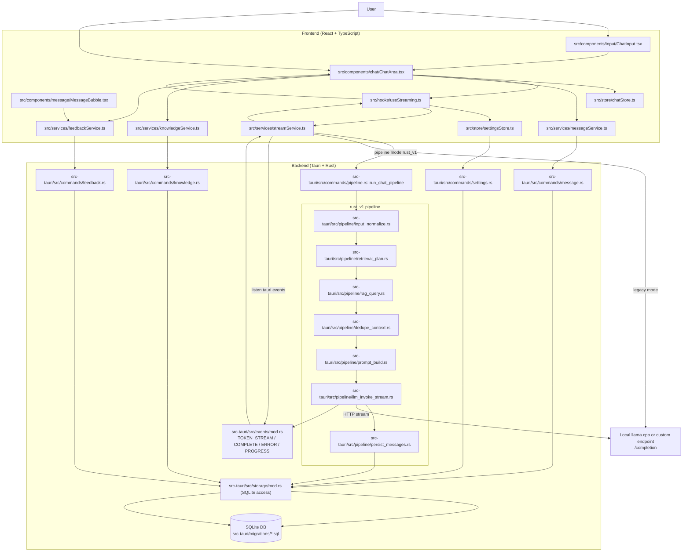

# llm-store

A local-first desktop app for practical LLM workflows.

`llm-store` is built for people who want the convenience of ChatGPT-like UX without giving up control of their data, model routing, and experiment history. It runs as a desktop app, keeps chats and knowledge local by default, and gives you a reliable path from "ask a question" to "save the result", including retrieval, streaming, and feedback tracking.

The goal is not just chatting with a model. The goal is to support real day-to-day work:

- ask questions against your own documents
- compare or switch model endpoints
- watch responses stream live
- keep a trace of what worked (and what did not) through feedback
- export structured data when you need to fine-tune or audit

In short, this project is a local LLM workspace: chat UI, retrieval pipeline, persistence layer, and feedback loop in one place.

Built with:

- React + TypeScript for UI
- Tauri + Rust for backend commands/orchestration
- SQLite for chats, knowledge docs, and feedback

## Why this project exists

Most LLM tooling sits at one of two extremes: either a simple chat box with little control, or a heavy platform that is hard to run locally. `llm-store` tries to stay in the middle:

- local-first defaults for privacy and low friction
- enough pipeline structure to make behavior predictable
- simple UI that still exposes useful operational details (progress states, streaming, feedback history)

It is intentionally opinionated about reliability. If one layer in retrieval fails, the app degrades gracefully where possible, instead of collapsing the whole user request.

## What this app does

- Chat with local or custom model endpoints
- Stream tokens in real time
- Compact conversation tokens automatically to stay within model context limits
- Add docs/files into a Knowledge store (chunk + embedding + semantic search)
- Collect feedback history and export it in OpenAI-style JSON/JSONL
- Organize conversations with ChatGPT-like Projects + Recent flow

## Screenshots

### Chat



### Knowledge



### Feedback



 

## Quick start

```bash
npm install
```

Frontend dev:

```bash
npm run dev
```

Desktop app (Tauri shell):

```bash
npx tauri dev
```

## Core flow (chat)

When user sends a prompt:

1. UI appends an optimistic user message
2. If pipeline mode is `rust_v1`, app calls `run_chat_pipeline`
3. If pipeline mode is `legacy`, frontend calls model endpoint directly
4. Tokens are streamed via Tauri events
5. Assistant response is shown live, then persisted

### Rust pipeline order (`rust_v1`)

Top-to-bottom layers:

1. `input_normalize` (fail fast)
2. `retrieval_plan` (fallback to vector)
3. `rag_query` (on failure continue with empty context)
4. `dedupe_context` (on failure passthrough raw chunks)
5. `prompt_build` (auto-compacts prior conversation + context budget; on failure use minimal safe prompt)
6. `llm_invoke_stream` (terminal if this fails)
7. `persist_messages` (if this fails, response still stays delivered)

Progress events are emitted per layer (`started/success/fallback/failed`).

In UI, user first sees small plan/progress text, then streamed cursor text appears after tokens start. This avoids overlap and feels more natural.
Model routing now uses the same custom/local endpoint settings across `legacy` and `rust_v1`, including custom bearer auth when configured.

## Knowledge flow

1. User adds files (`txt/md/json/csv/pdf/docx` + code/text formats)
2. File text is extracted
3. Text is chunked
4. Embeddings are generated and stored
5. Chunk content is indexed into SQLite FTS for fast candidate lookup
6. Search can run in Knowledge view (`vector` or `graph` mode) over indexed candidates
7. Chat retrieval in `rust_v1` uses selected docs only (no implicit global retrieval)

Knowledge screen now also shows a live ingest indicator (reading/chunking/embedding/saving), so you can see what's happening while indexing.

## Feedback flow

- Like/dislike is saved per assistant message
- Feedback History view supports filtering
- Export buttons provide OpenAI-style datasets:
  - `.jsonl` (one record per line)
  - `.json` (array form)

Record shape is:

- `messages: [{role: "user"}, {role: "assistant"}]`
- `metadata: feedback_id, message_id, rating, created_at, source`

## Project map

- `src/components` UI
- `src/services` frontend service layer + Tauri invokes
- `src/store` Zustand state
- `src-tauri/src/commands` backend command entrypoints
- `src-tauri/src/pipeline` rust_v1 layered pipeline
- `src-tauri/src/storage` DB logic
- `src-tauri/migrations` schema changes

## High-level architecture (graph)



### Complete workflow (end-to-end)

```mermaid
flowchart LR
    A["1. User submits prompt\nsrc/components/input/ChatInput.tsx"] -->
    B["2. UI saves user message\nsrc/components/chat/ChatArea.tsx + src/services/messageService.ts"] -->
    C{"3. Pipeline mode?\nsrc/store/settingsStore.ts"}

    C -->|rust_v1| D["4A. run_chat_pipeline\nsrc/services/streamService.ts -> src-tauri/src/commands/pipeline.rs"]
    C -->|legacy| E["4B. Direct /completion streaming\nsrc/services/streamService.ts"]

    D --> F["5A. Rust layers execute in order\ninput_normalize -> retrieval_plan -> rag_query -> dedupe_context -> prompt_build -> llm_invoke_stream -> persist_messages"]
    E --> G["5B. SSE tokens parsed in frontend\nsrc/services/sseParser.ts"]

    F --> H["6. TOKEN_STREAM / PROGRESS events emitted\nsrc-tauri/src/events/mod.rs"]
    G --> I["6. Frontend emits token events\nsrc/services/streamService.ts"]

    H --> J["7. useStreaming buffers + flushes tokens\nsrc/hooks/useStreaming.ts"]
    I --> J

    J --> K["8. Live assistant text rendered\nsrc/components/chat/ChatArea.tsx + src/components/message/MessageBubble.tsx"]
    K --> L["9. Final assistant message persisted\nsrc/services/messageService.ts -> src-tauri/src/storage/mod.rs"]

    L --> M["10. Optional feedback captured/exported\nsrc/services/feedbackService.ts + src/components/layout/FeedbackView.tsx"]
    L --> N["11. Optional knowledge retrieval/index paths\nsrc/services/knowledgeService.ts + src/components/layout/KnowledgeView.tsx"]
```


