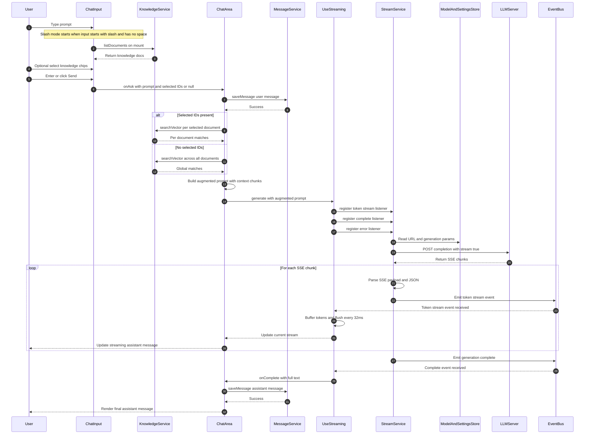
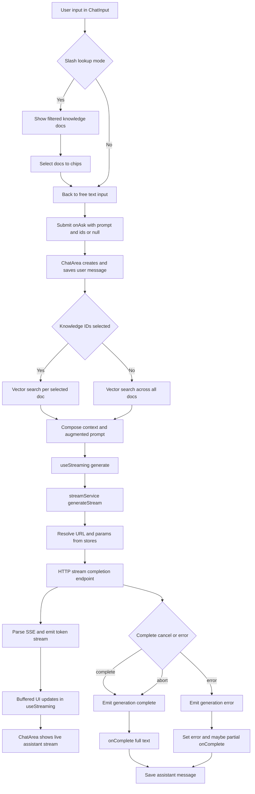
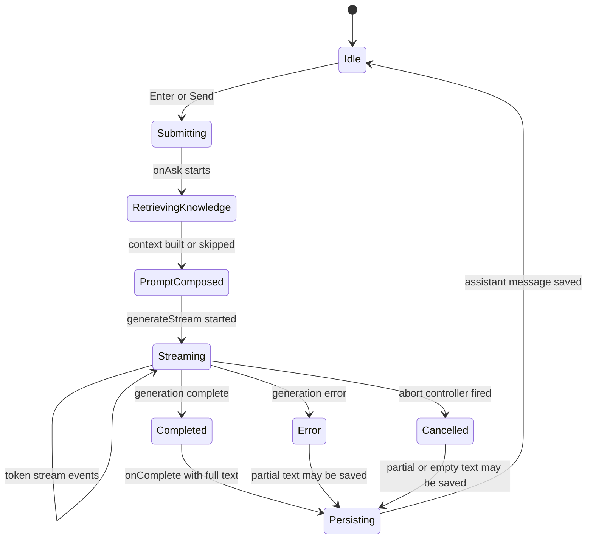

# Input-to-LLM Flow (Current Architecture)

## Scope
This document describes the current runtime flow from chat input submission to streamed LLM response rendering and persistence.

Primary files:
- `src/components/input/ChatInput.tsx`
- `src/components/chat/ChatArea.tsx`
- `src/hooks/useStreaming.ts`
- `src/services/streamService.ts`
- `src/services/sseParser.ts`
- `src/services/knowledgeService.ts`
- `src/services/messageService.ts`
- `src/store/modelStore.ts`
- `src/store/settingsStore.ts`
- `src/constants/index.ts`

## End-to-End Sequence

## Control Flow (Decision View)

## Runtime State Machine (Generation)

## Current Notes Relevant for Agent Harness Eval
- Chat retrieval path currently uses **vector search only** in chat (`searchVector`) even though Knowledge screen supports Vector and Graph mode.
- If no chip is selected, chat defaults to **all knowledge** (`ids = null`).
- Knowledge context is injected as plain text prefix into prompt (no structured tool call protocol yet).
- Streaming path is event based (`token_stream`, `generation_complete`, `generation_error`).
- Token rendering is buffered at about 32ms in `useStreaming` to reduce rerenders.
- Cancellation uses `AbortController`; completion event is still emitted on abort.
- On errors or cancel, partial text can still be persisted via `onComplete` path.

## Recommended Harness Hook Points (for next phase)
1. `pre_submit`: validate inputs, policy checks, test case tags.
2. `retrieval_plan`: choose vector, graph, or hybrid before retrieval.
3. `context_assembly`: deterministic chunk packing and token budget tracking.
4. `prompt_compile`: final prompt template and trace metadata.
5. `stream_observer`: token level telemetry, latency, and stop reason.
6. `post_completion_eval`: factuality checks, citation coverage, safety.
7. `persistence_gate`: decide whether to store partial or empty outputs.

## Quick Trace IDs You Can Add Later
- `request_id` per user send
- `retrieval_mode` vector graph hybrid
- `selected_doc_ids`
- `retrieved_chunk_ids`
- `prompt_tokens_est`
- `first_token_latency_ms`
- `stream_duration_ms`
- `finish_reason`
- `persisted_message_id`
