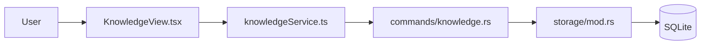
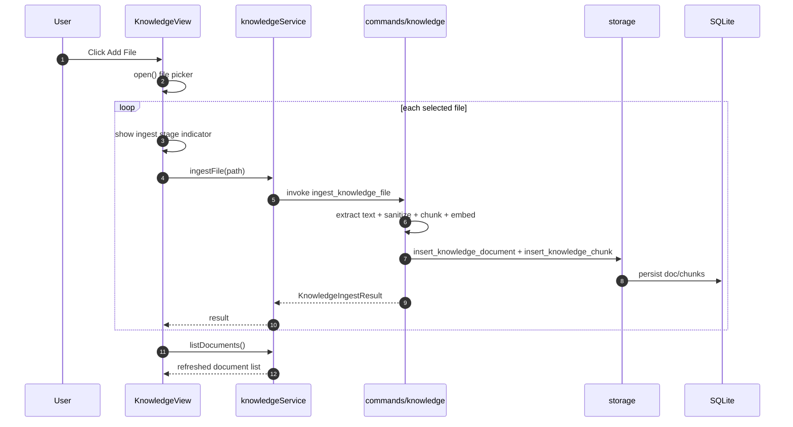
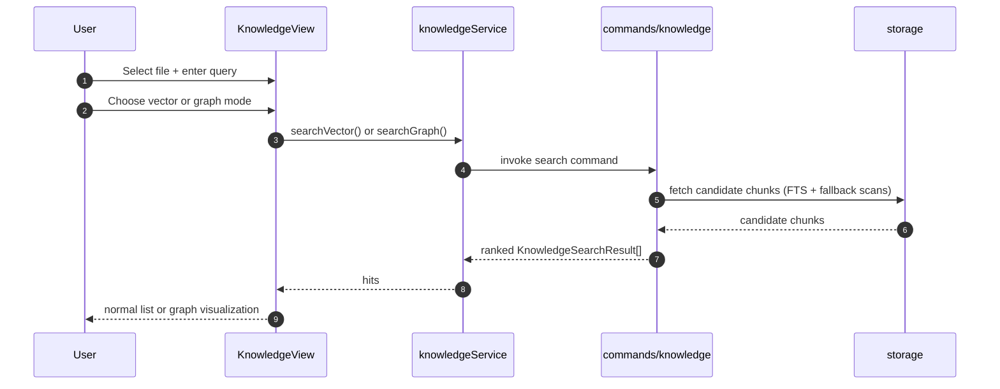
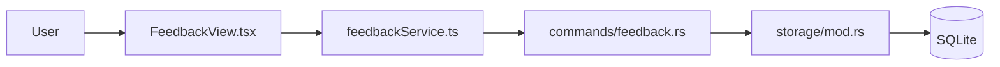
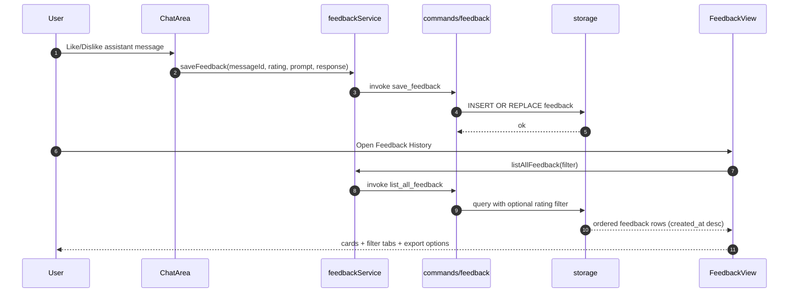

# Knowledge + Feedback UI Architecture (Verified)

## Scope
This document verifies the current flow architecture against `README.md` and defines the current UI/data flow for:

- Knowledge screen (`KnowledgeView`)
- Feedback History screen (`FeedbackView`)

It is based on the live code, not planned behavior.

## Verification Summary Against README

### Chat + Pipeline flow (README)
- Verified: `rust_v1` path calls `run_chat_pipeline`.
  - `src/components/chat/ChatArea.tsx` (`handleAskRust`)
  - `src/services/streamService.ts` (`runChatPipeline`)
  - `src-tauri/src/commands/pipeline.rs`
- Verified: legacy path calls model endpoint directly from frontend.
  - `src/components/chat/ChatArea.tsx` (`handleAskLegacy`)
  - `src/services/streamService.ts` (`generateStream`)
- Verified: rust pipeline layer order and fallback behavior matches README.
  - `src-tauri/src/pipeline/orchestrator.rs`

### Knowledge flow (README)
- Verified: ingest + chunk + embed + save workflow exists.
  - `src/components/layout/KnowledgeView.tsx` (`handleUpload`)
  - `src/services/knowledgeService.ts`
  - `src-tauri/src/commands/knowledge.rs` (`ingest_knowledge_file`)
- Verified: Knowledge search supports `vector` and `graph` modes in Knowledge screen.
  - `src/components/layout/KnowledgeView.tsx` (`searchMode`)
  - `src-tauri/src/commands/knowledge.rs` (`search_knowledge_vector`, `search_knowledge_graph`)
- Verified: chat retrieval uses selected docs only (no implicit global retrieval).
  - Legacy path: `ChatArea.tsx` only calls search when IDs are selected.
  - Rust path: `rag_query.rs` returns empty retrieval when `document_ids` is `None`.

### Feedback flow (README)
- Verified: feedback stored per assistant message and supports filtering.
  - `src/components/chat/ChatArea.tsx` (`handleFeedback`)
  - `src/services/feedbackService.ts`
  - `src/components/layout/FeedbackView.tsx` (`filter`)
  - `src-tauri/src/storage/mod.rs` (`list_all_feedback`)
- Verified: export as OpenAI-style JSONL/JSON exists.
  - `src/components/layout/FeedbackView.tsx` (`handleExportJsonl`, `handleExportJson`)

### Mismatch found
- README says UI shows plan/progress text before streamed cursor text.
- Current code tracks progress events in `useStreaming`, but no component currently renders `progress`/`progressSteps`.
  - Progress state producer: `src/hooks/useStreaming.ts`
  - Consumer rendering: not present in `ChatArea.tsx` or `ChatInput.tsx`

## Knowledge Screen Architecture

### UI responsibilities
- Left panel: indexed files list, selection, delete.
- Right panel:
  - Query input
  - Search mode toggle (`vector`/`graph`)
  - Result display mode toggle (`normal`/`graph`)
  - `Top 3 only` toggle
  - Results list or graph modal
- Header:
  - document + chunk counters
  - Add File action
  - live ingest status indicator (`Reading file`, `Chunking content`, `Building embeddings`, `Saving vectors`)

Primary file:
- `src/components/layout/KnowledgeView.tsx`

### Data flow

### Knowledge ingestion flow

### Knowledge search flow

### Important implementation details
- Document selection is single-select (`selectedDocumentId`).
- Empty query returns full chunk list for selected document.
- Graph view has two layers:
  - retrieval mode (`vector` vs `graph`) for search backend
  - render mode (`normal` vs `graph`) for result presentation
- Graph modal opens automatically when render mode is `graph` and results exist.

## Feedback History Architecture

Primary file:
- `src/components/layout/FeedbackView.tsx`

### UI responsibilities
- Header with total count
- Filters: `all`, `good`, `bad`
- Refresh action
- Export dropdown: `jsonl`, `json`, `csv`
- Expandable feedback cards with prompt + response

### Data flow

### Feedback capture + history flow

### Export behavior
- JSONL and JSON export use OpenAI-style records:
  - `messages: [{role:user},{role:assistant}]`
  - `metadata: feedback_id, message_id, rating, created_at, source`
- CSV export is also implemented as an additional convenience format.

## Recommended next implementation step
If you want architecture and UI to fully match README wording, implement a small visible progress strip in `ChatArea` (or above `ChatInput`) using:
- `progress`
- `progressSteps`
- `isProgressVisible`
from `useStreaming`.
